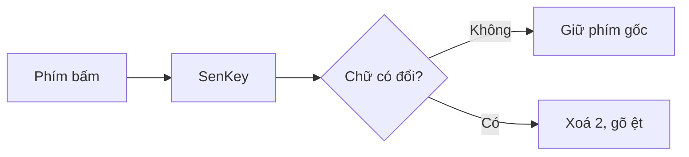
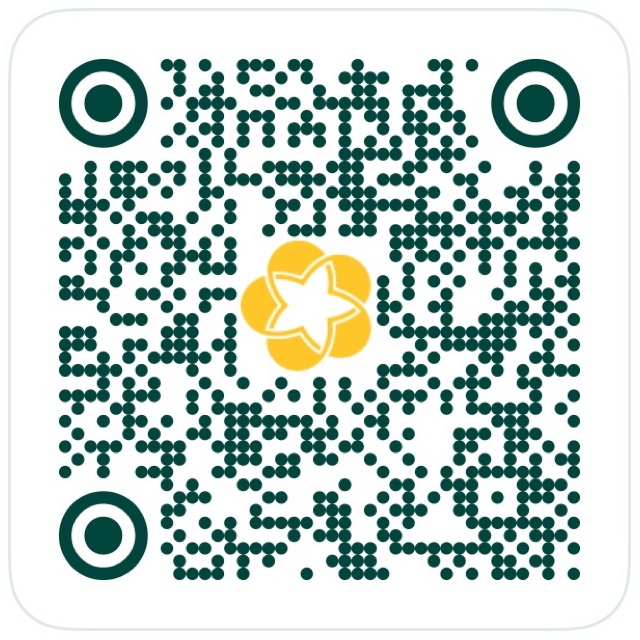

<div align="center">

# 🇻🇳 SenKey

**Bộ gõ tiếng Việt cho macOS: nhẹ, ổn định, không lặp chữ**

Telex · VNI · kiểu gõ riêng cho từng ứng dụng · không gạch chân (marked text)


[](LICENSE)

[Cài đặt](#-cài-đặt) · [Sử dụng](#-sử-dụng) · [Cách hoạt động](#-vì-sao-ổn-định-hơn) · [Gỡ cài đặt](#️-gỡ-cài-đặt) · [Donate](#-nạp-token-cho-tác-giả)

</div>

---

## ✨ Tính năng

|  |  |
|---|---|
| ⌨️ **Telex & VNI** | Đặt dấu kiểu mới (`hoà`) hoặc kiểu cũ (`hòa`), kiểm tra âm tiết hợp lệ |
| 🎯 **Riêng cho từng app** | VS Code gõ tiếng Anh, Messenger gõ Telex, Excel gõ VNI. SenKey tự nhớ |
| 🚫 **Không marked text** | Không có chữ gạch chân, không lặp chữ kiểu `viêviệt` |
| 🌐 **Sửa lỗi ô gợi ý** | Thanh địa chỉ Chrome / Safari / Firefox / Edge / Arc / Cốc Cốc, Spotlight, Raycast, Alfred, Excel |
| 🔤 **Tự khôi phục tiếng Anh** | `windows`, `google`, `facebook` vẫn là chính nó |
| ⚡ **Siêu nhẹ** | Engine xử lý mỗi phím trong khoảng 1,2 µs, app nằm gọn trên menu bar |
| 🛡️ **An toàn** | Tự gỡ bộ bắt phím trong 0,5 giây khi mất quyền Trợ năng, không làm treo máy |

## 📦 Cài đặt

### ⚡ Cách nhanh nhất: dán một dòng lệnh (khuyên dùng)

1. Mở **Terminal**: nhấn **⌘ Command + Space**, gõ `Terminal`, nhấn **Enter**.
2. Chép dòng dưới đây, dán vào Terminal (**⌘ Command + V**) rồi nhấn **Enter**:

   ```bash
   curl -fsSL https://raw.githubusercontent.com/tdHuy22/SenKey/main/get.sh | bash
   ```

3. Cửa sổ **Chào mừng đến với SenKey** hiện ra. Làm theo từng bước trong đó, bước nào xong sẽ có dấu ✓ xanh.

Cách này tự tải bản mới nhất, cài vào **Applications** và mở app. macOS không chặn gì cả.
**Muốn cập nhật:** chạy lại đúng dòng lệnh trên.

### 💿 Hoặc tải file cài đặt

1. Tải [**SenKey.dmg**](https://github.com/tdHuy22/SenKey/releases/latest/download/SenKey.dmg), mở file, kéo **SenKey** vào thư mục **Applications**.
2. Mở SenKey trong Applications. Lần đầu macOS sẽ báo *"không thể xác minh nhà phát triển"*, vì SenKey chưa trả phí để Apple công chứng:
   - Bấm **Xong**.
   - Vào **Cài đặt hệ thống → Quyền riêng tư & Bảo mật**, kéo xuống dưới cùng, bấm **Vẫn mở** (*Open Anyway*), nhập mật khẩu máy.
3. Cửa sổ hướng dẫn của SenKey hiện ra. Làm theo từng bước là xong.

### ✅ Cửa sổ hướng dẫn sẽ nhờ bạn

1. **Cho phép SenKey dùng bàn phím:** bấm **Mở Cài đặt**, bật công tắc cạnh **SenKey** trong danh sách **Trợ năng**.
2. **Không dùng cùng lúc bộ gõ khác:** nếu đang chọn tiếng Việt của Apple hoặc đang mở EVKey, UniKey… thì chuyển về **ABC** hoặc thoát app đó.
3. **Gõ thử** ngay trong cửa sổ. Thấy chữ **Vi** trên thanh menu (góc trên bên phải màn hình) là xong 🎉

Mở lại cửa sổ này bất cứ lúc nào: bấm **Vi/En** trên thanh menu → **Hướng dẫn cài đặt…**

> [!WARNING]
> **Đừng tắt quyền Trợ năng của SenKey khi app đang chạy.** Trên một số bản macOS, việc này có thể làm treo bàn phím và chuột.
> Muốn tắt quyền thì bấm **Vi/En → Thoát SenKey** trước.

<details>
<summary><b>🛠️ Dành cho lập trình viên: build từ mã nguồn</b></summary>

<br>

Chỉ cần Xcode Command Line Tools (`xcode-select --install`).

```bash
git clone https://github.com/tdHuy22/SenKey.git
cd SenKey
./make-cert.sh   # chỉ cần chạy một lần
./install.sh     # build, chép vào /Applications, mở app
```

`make-cert.sh` tạo chứng chỉ tự ký **"SenKey Dev"** trong một keychain riêng tại
`~/Library/Application Support/SenKey/signing/`. Nó không đụng vào keychain đăng nhập và không hỏi mật khẩu máy.
`build.sh` tự dùng chứng chỉ này, nên mọi bản build có **cùng chữ ký**. Nhờ vậy khi cập nhật bằng `./install.sh`,
bạn **không phải cấp lại quyền Trợ năng**. Không có chứng chỉ thì app được ký ad-hoc và mỗi lần cài phải cấp lại quyền.

Đóng gói bản phát hành (`build/release/SenKey.zip` và `SenKey.dmg`): `./package.sh`.

</details>

## 🚀 Sử dụng

| Thao tác | Kết quả |
|---|---|
| Nhìn biểu tượng **Vi / En** trên menu bar | Trạng thái của ứng dụng đang dùng |
| Nhấn rồi thả **⌃⇧** (Control + Shift) | Đảo Việt/Anh cho *riêng app hiện tại*, app tự ghi nhớ |
| Menu → **Kiểu gõ cho ‹app›** | Theo mặc định · Telex · VNI · Tiếng Anh |
| Menu → **Cài đặt & danh sách ứng dụng…** | Xem, sửa, xoá cài đặt của từng app |

Phím tắt có thể đổi sang **⌥Z**, **⌃Space** hoặc **⌘⇧Space** trong Cài đặt.

## 🧠 Vì sao ổn định hơn



- **Không dùng marked text.** Mỗi phím chỉ gửi phần chênh lệch: `viet` + `j` → xoá 2 ký tự, gõ `ệt`.
  Nếu phím không làm thay đổi gì, phím gốc được giữ nguyên.
- **Ô gợi ý được xử lý riêng.** SenKey gõ trước một ký tự vô hình để huỷ phần gợi ý đang bôi đen rồi mới xoá.
  Bật/tắt được cho từng app.
- **Nhận đúng app đang nhận phím** qua Accessibility. Spotlight và Raycast không phải app ở phía trước, nhưng vẫn được nhận đúng.
- **Không sửa nhầm chỗ khác.** Từ đang gõ bị bỏ khi bạn click chuột, đổi app hoặc dùng ⌘ / ⌃ / ⌥.
- **Tự hồi phục.** Nếu macOS tắt event tap khi hệ thống quá tải, SenKey tự bật lại.

## ⚠️ Giới hạn

- Ô mật khẩu và **Secure Keyboard Entry** (Terminal, 1Password…) chặn mọi bộ gõ dạng này, nên gõ ra chữ không dấu.
- Sau khi nhấn Space rồi Backspace quay lại từ trước, cần gõ lại cả từ để thêm dấu.

## 🗑️ Gỡ cài đặt

1. Bấm **Vi/En** trên thanh menu → **Thoát SenKey**.
2. Mở **Applications**, kéo **SenKey** vào **Thùng rác**.
3. Vào **Cài đặt hệ thống → Quyền riêng tư & Bảo mật → Trợ năng**, chọn SenKey rồi bấm dấu **−** để xoá khỏi danh sách.

Nếu cài từ mã nguồn, chạy `./uninstall.sh`: script làm cả ba bước trên và xoá luôn cài đặt đã lưu.

## 🏗️ Cấu trúc dự án

```
SenKey/
├── Sources/
│   ├── VietEngine/VietnameseEngine.swift   # Telex/VNI, vị trí dấu, kiểm tra hợp lệ, backspace
│   ├── SenKey/
│   │   ├── KeyboardHook.swift              # CGEventTap, gửi Backspace + Unicode, phím tắt
│   │   ├── Settings.swift                  # cài đặt theo ứng dụng (UserDefaults)
│   │   ├── AppDelegate.swift               # menu bar
│   │   ├── SettingsView.swift              # cửa sổ cài đặt (SwiftUI)
│   │   └── OnboardingView.swift            # cửa sổ hướng dẫn lần đầu
│   └── EngineTests/main.swift              # 77 test mô phỏng gõ, chạy tự động khi build
├── Tools/KeyProbe/                         # công cụ ghi log sự kiện phím để debug
├── build.sh · install.sh · uninstall.sh · make-cert.sh
├── get.sh · package.sh                     # cài bằng một lệnh · đóng gói bản phát hành
└── LICENSE                                 # MIT
```

Build thủ công: `./build.sh` (dùng `swiftc` trực tiếp, không cần Xcode project hay SwiftPM). Build xong sẽ có file `build/SenKey.app` dạng universal (arm64 + x86_64).

---

## 📄 Giấy phép

[MIT](LICENSE): tự do dùng, sửa, chia sẻ, kể cả cho mục đích thương mại, miễn là giữ lại thông báo bản quyền.

## ☕ Nạp token cho tác giả

SenKey **miễn phí**. Nhưng code này được viết cùng một con AI, và con AI đó **ăn token như uống nước** 🥲

Mỗi lần sửa bug lặp chữ, nó đọc lại `KeyboardHook.swift` từ đầu, suy nghĩ ba trang giấy rồi mới kết luận:
*"À, lỗi do keycode 0"*. Nếu SenKey giúp bạn bớt gõ `viêviệt`, hãy cân nhắc nạp chút năng lượng:

| Gói | Giá | Bạn nhận được |
|---|---|---|
| 🍵 **Trà đá** | [5.000đ](https://img.vietqr.io/image/BIDV-7110435358-qr_only.png?addInfo=Donate%20SenKey&amount=5000) | AI đọc được đúng một câu `import AppKit` |
| ☕ **Cà phê sữa đá** | [20.000đ](https://img.vietqr.io/image/BIDV-7110435358-qr_only.png?addInfo=Donate%20SenKey&amount=20000) | Đủ token để AI xin lỗi *"Bạn nói đúng, tôi đã nhầm"* thêm 3 lần |
| 🍜 **Tô phở** | [50.000đ](https://img.vietqr.io/image/BIDV-7110435358-qr_only.png?addInfo=Donate%20SenKey&amount=50000) | Sửa được một bug. Có thể sinh thêm một bug khác, miễn phí |
| 🧋 **Trà sữa full topping** | [100.000đ](https://img.vietqr.io/image/BIDV-7110435358-qr_only.png?addInfo=Donate%20SenKey&amount=100000) | AI được *thinking* thật sâu thay vì đoán mò |
| 🔋 **Sạc đầy context window** | [500.000đ](https://img.vietqr.io/image/BIDV-7110435358-qr_only.png?addInfo=Donate%20SenKey&amount=500000) | Refactor cả project mà không bị quên đầu quên đuôi |
| 🚀 **Nhà tài trợ kim cương** | [Tuỳ tâm](https://img.vietqr.io/image/BIDV-7110435358-qr_only.png?addInfo=Donate%20SenKey) | Tên bạn được khắc trong một comment `// cảm ơn` ở `VietnameseEngine.swift` |

<div align="center">



Quét bằng app ngân hàng bất kỳ (VietQR · Napas 247), MoMo hoặc ZaloPay. Bấm vào **giá** trong bảng để có mã QR điền sẵn số tiền 😉

<sub>Không donate cũng không sao: ⭐ star repo cũng là một dạng token tinh thần.</sub>

</div>

---

<div align="center">
<sub>Làm với ❤️, ☕ và rất nhiều token tại Việt Nam.</sub>
</div>
